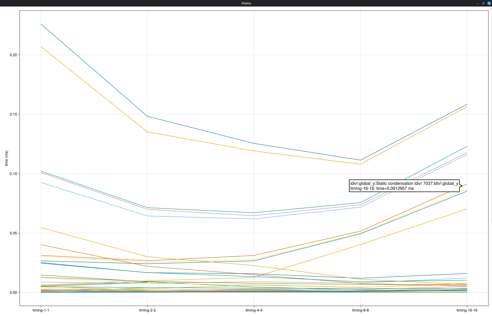

# TimerOutputsComparisons

[](https://github.com/johnomotani/TimerOutputComparisons.jl/actions/workflows/CI.yml?query=branch%3Amain)

Provides some helper functions to save/load TimerOutput objects, and plot
comparisons of them. This may be useful to compare performance with different
settings, or between different versions of some code.

In complex examples it may be useful to save the TimerOutput objects to files,
and then plot them as a separate post-processing step, so in the example below
we save and re-load the TimerOutput objects, even though it is possible to pass
them directly to `compare_timers()`.

Usage
-----

```julia
using TimerOutputComparisons
using TimerOutputs

delay_times = [0.1, 0.2, 0.3]

for dt ∈ delay_times
    to = TimerOutput()
    @timeit to "sleep" sleep(dt)
    filename = "foo$dt.jld"
    save_timer(filename, to)
end

compare_timers(["foo$dt.jld" for dt ∈ delay_times]...)
```

To plot only one or two quantities, use the `include` kwarg and pass one or
more of `:ncalls`, `:time` and `:allocs` to `include`. The legend can also be
removed with `legend=false`, and averages instead of total time and allocs for
each timer can be plotted with `averages=true`. For example
```julia
compare_timers(["foo$dt.jld" for dt ∈ delay_times]...; include=:time,
               legend=false, averages=true)
```

Example output
--------------

Below is the output from comparing runs of a parallelised matrix solver code on
different numbers of cores, using
```julia
julia> using TimerOutputComparisons, TimerOutputs

julia> compare_timers("timing-1-1.jld", "timing-2-2.jld", "timing-4-4.jld", "timing-8-8.jld", "timing-16-16.jld"; use_data=:time, legend=false, averages=true, root="Static condensation ldiv! 16641")
```
where the legend is suppressed because there are too many entries - the curves
can still be identified using the tooltip that appears when hovering the cursor
over the curve.

